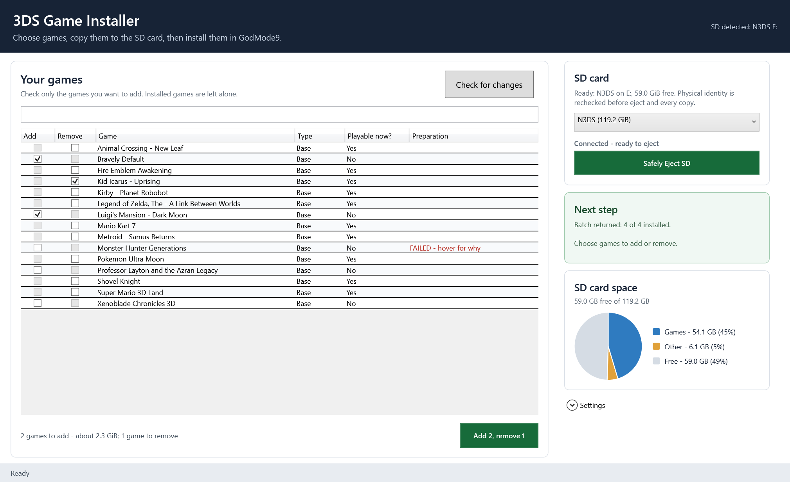

# 3DS Game Installer

A Windows app for installing games you own on a modded Nintendo 3DS or New 3DS. Tick the games you
want, click one button, and the app converts them, checks them, and copies them to your SD card. Then
you install them on the console with GodMode9. When the card comes back to the PC, the app confirms
what installed and cleans up after itself.



- **One button for every change.** Tick games to add or remove. The button names what it will do, for
  example *Add to SD card* or *Add 2, remove 1*.
- **Every game is checked first.** Each game is converted on the PC and validated before it reaches
  the card: content hashes, Title ID, region, save size, icon and encryption state. A bad file is
  marked **FAILED** with the reason, and the other games carry on.
- **The card is cleaned up for you.** When the card returns, games that installed are confirmed
  against the files the app prepared. The install folder is removed, and anything that didn't install
  is copied again.
- **More than one SD card is fine.** Each card keeps its own queue and removal list, recognised by the
  card itself, so swapping cards (or 3DS systems) never mixes them up.
- **Cancel keeps finished work.** While a job runs, Cancel is the only control. Anything already
  finished is kept, and only the step in progress is undone.
- **It doesn't touch console data.** The app never edits the console's encrypted `Nintendo 3DS` folder.
  Installing and deleting games always happen on the 3DS itself.

## What you need

- A 3DS, 2DS or New 3DS running custom firmware with **GodMode9**. Set this up by following
  [3ds.hacks.guide](https://3ds.hacks.guide/); this app does not do it for you.
- A Windows 10 or 11 PC. Windows PowerShell 5.1 is built in.
- [Python 3](https://www.python.org/downloads/), which the converter uses. The installer's default
  options are fine.
- A **reliable** USB microSD reader. A flaky reader can corrupt copies without any error message.
- The console's SD card, formatted FAT32 as 3ds.hacks.guide describes.
- Game files (`.3ds`, `.cci` or `.cia`) **dumped from games you own**. This project includes no
  games, keys or console data, and does not help you obtain them.

## Getting started

1. Download this repository (**Code > Download ZIP**) and unzip it, or clone it.
2. Power off the 3DS and put its SD card in the PC's reader.
3. Double-click **`start.vbs`**. The app opens without a console window or an admin prompt.
4. The first time, the app sets itself up. Follow the green **Finish setup** card:
   - It installs its helper tools by itself, usually in under a minute. It downloads pinned, checksum-
     verified copies of [CTRTool](https://github.com/3DSGuy/Project_CTR) and
     [3dsconv](https://github.com/ihaveamac/3dsconv) into `%LOCALAPPDATA%\BackupsNew3DS\LibraryManager`.
     If Python is missing, the card says so; install it, then click **Set up helper tools**.
   - Click **Choose game folder** and pick the folder that holds your game files.
   - Converted games are kept in an `InstallReady` folder created beside your game folder. It needs
     room for a converted copy of each game, and you can move it in **Settings**.
5. The game list fills in. Tick **Add** for games showing *Playable now? No*, then click the button.
6. When the green **Next step** card says *Batch ready*, click **Safely Eject SD**. On the 3DS, open
   GodMode9 and go to the folder it names under `SDCARD/cias/InstallQueue/`. Mark every game with `L`,
   then choose **Install game image**.
7. Put the card back in the PC. The app does the rest.

Encrypted cartridge dumps also need a `boot9.bin` dumped from your own console. The boot9 setting
appears in **Settings** only when your library contains such a dump.

See [docs/LIBRARY_MANAGER.md](docs/LIBRARY_MANAGER.md) for the full guide: removal, cancelling, the
SD card space chart, and the safety model.

## Safety

- **Your files are never changed.** Source games are hashed and never modified. Conversion works on a
  disposable copy, and `--ignore-bad-hashes` is never used.
- **The right card is checked before every write.** Before each write, the SD card is identified again
  from Windows disk metadata. It must be a USB, non-system, MBR disk with one FAT32 partition and a
  `Nintendo 3DS` folder. The app never assumes a drive letter.
- **Writes stay in the app's own folders.** The app only writes to its own folders under
  `cias/InstallQueue`, and it never formats or repartitions anything.
- **Settings and history stay on your PC.** They're stored under `%LOCALAPPDATA%`, not in this folder.

## Running the tests

```powershell
powershell.exe -NoProfile -ExecutionPolicy Bypass -File .\tests\run-all-tests.ps1
```

The tests use synthetic cards and games, run against a throwaway state folder, and don't need a real
SD card. Optional real-file conversion checks run when you pass `-CtrToolPath`, `-Test3dsPath` and
`-TestCiaPath`.

## Credits

This app is built on other people's work. None of their code is included in this repository: the setup
step downloads the two conversion tools from their official sources onto your PC.

- **CTRTool**, from [Project_CTR](https://github.com/3DSGuy/Project_CTR) by 3DSGuy and contributors,
  reads and checks 3DS game files. The app uses its official v1.3.0 release.
- **[3dsconv](https://github.com/ihaveamac/3dsconv)** by ihaveamac (MIT) converts `.3ds`/`.cci` dumps
  to CIA. The app uses a pinned commit.
- **[pyaes](https://github.com/ricmoo/pyaes)** by Richard Moore (MIT) is the AES library 3dsconv uses.
- **[GodMode9](https://github.com/d0k3/GodMode9)** by d0k3 and contributors (GPL-3.0) installs the
  games on the console. It isn't included; set it up with the guide below.
- **[3ds.hacks.guide](https://3ds.hacks.guide/)** ([source](https://github.com/hacks-guide/Guide_3DS),
  MIT) is the custom firmware and SD card guide this app relies on.

## License

[MIT](LICENSE). This project isn't affiliated with or endorsed by Nintendo. Use it only with games you
own.
